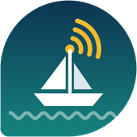
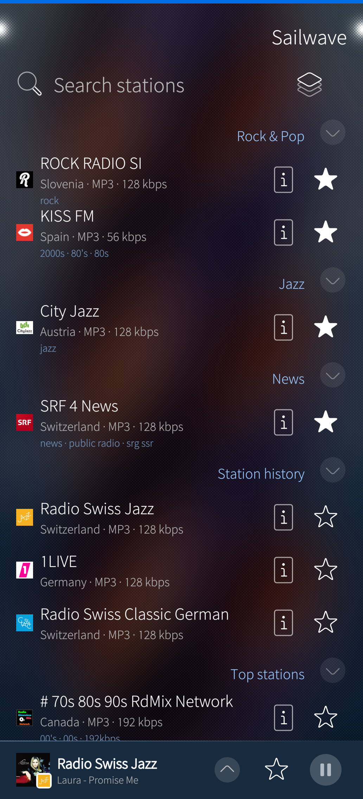
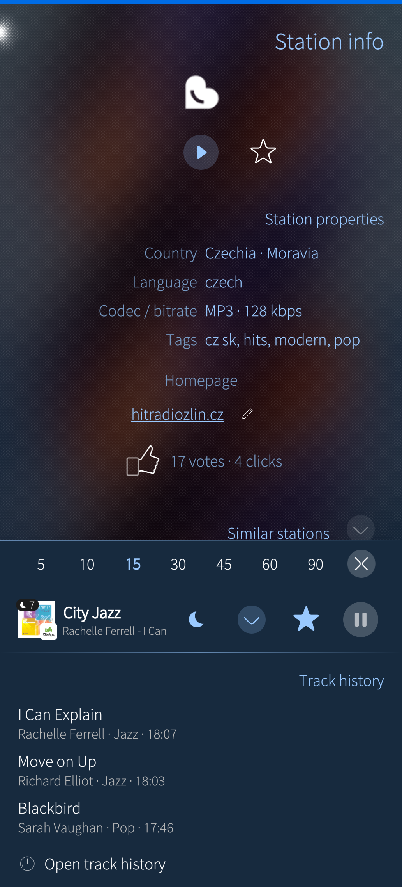
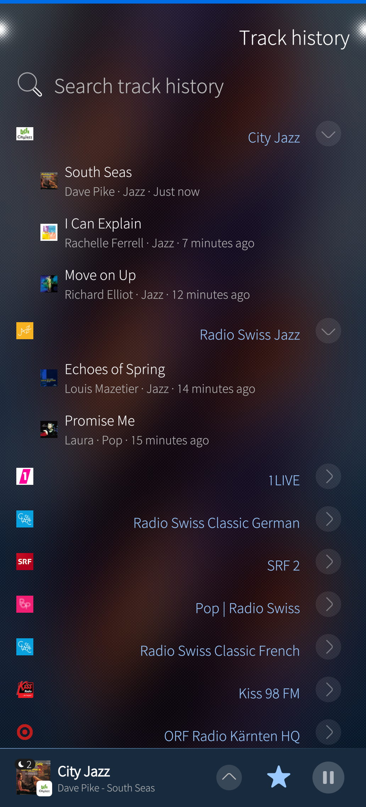
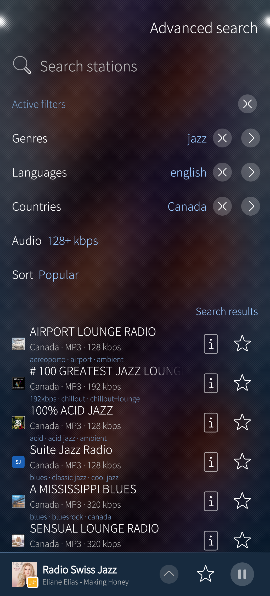
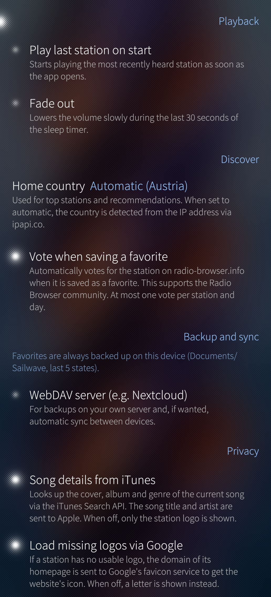

  

# Sailwave

**Internet radio for Sailfish OS** – thousands of stations from the community database [radio-browser.info](https://www.radio-browser.info), in a native Silica interface.

  

  
  
  
  
  

More: [app cover](screenshots/cover.png) · [lock screen](screenshots/lock-screen.png) · [restoring a backup](screenshots/backup.png)

## Features

- **Discover** – top stations scored by your listening profile (favorites, history, current station, home country), station history, quick search
- **Advanced search** – free text plus genre, language and country filters that expand right on the page, audio quality and sorting
- **Favorites** – user-named groups, reorder by drag and drop (also across groups), a dedicated management page, reachability check with "Find alternative" for streams that stopped working
- **Backup and sync** – automatic JSON backup in `Documents/Sailwave` with the last five states; manual backups with date and time (JSON or M3U playlist) on the device, shared via the system's share menu or on a WebDAV server (e.g. Nextcloud); restore from any of them (replace or add missing); optional automatic sync via WebDAV with conflict handling
- **Track history** – grouped by station, searchable, with album covers, album and genre from the iTunes Search API (optional)
- **Station info** – details, votes and clicks, homepage correction, similar stations (by tags, or by the genres a station plays)
- **Player** – global player bar with sleep timer (fade out), app cover with actions (play/pause, next favorite in the same group), lock screen / MPRIS with cover art
- **Sailfish native** – Silica components, adaptive colors following the ambience, pulley menus, remorse countdowns for every delete action
- **Languages** – English, German, French, Spanish

## Installation
Planned:
- **Chum** 
- **OpenRepos**
- **Jolla Store**

## Permissions

Sailwave runs sandboxed (Sailjail) and only asks for:

| Permission | Why |
|---|---|
| Internet | Station data, streams, album covers |
| Audio | Playback, lock screen controls (MPRIS) |
| Documents | Favorites backup and M3U export in `Documents/Sailwave` |
| Downloads | Choosing a backup file from Downloads when restoring (e.g. one received by mail) |
| Secrets | Storing the WebDAV password encrypted in the system's secure storage (Sailfish Secrets) |

## Privacy

Sailwave has no account, no tracking and no ads, and the developer runs no server – no data from the app reaches the developer. The app contacts these services directly from your device:

- **radio-browser.info** – station data; a click is counted when a station is played, and votes are sent when you vote (or automatically when saving a favorite, if enabled).
- **The radio stations** – streams and station logos are loaded from the stations' own servers.
- **Google favicon service** – only for stations without a usable logo: the domain of the station's homepage is sent to get its icon (can be turned off in the settings).
- **iTunes Search API (Apple)** – if "Song details from iTunes" is enabled, the title and artist of the current song are sent to look up the cover, album and genre.
- **ipapi.co / api.country.is** – to detect your home country from your IP address, unless you set it in the settings.
- **Your WebDAV server** – only if you set one up (manual backups and optional automatic sync). The password is kept encrypted in the system's secure storage (Sailfish Secrets), not in the app's database.

Album covers and station logos are cached on the device; "Clear cache" in the settings removes them. Details: [`PRIVACY.md`](PRIVACY.md).

## Building

Requirements: [Sailfish SDK](https://docs.sailfishos.org/Tools/Sailfish_SDK/) with Qt Creator.

1. Open `harbour-sailwave.pro` in Qt Creator.
2. Choose a Sailfish OS build target (e.g. aarch64 or armv7hl).
3. Build and deploy as RPM to a device or the emulator.

Notes:
- After adding or changing C++ classes, run "Clean" and qmake.
- Starting the app from Qt Creator bypasses Sailjail; for sandbox tests start it from the app grid.
- Optional runtime dependency for lock screen controls: `amber-mpris` (the app runs without it).

## Project documents

- [`TODO.md`](TODO.md) – roadmap up to version 1.0 and beyond
- [`DESIGN.md`](DESIGN.md) – architecture, conventions and design decisions, including what was tried and rejected
- [`TEST-PROTOCOL.md`](TEST-PROTOCOL.md) – manual test protocol on a real device

## Translations

Translation files are in `translations/` (Qt Linguist `.ts`). Source strings are English. Contributions for further languages are welcome.

## Development and AI assistance

Sailwave is developed with the assistance of an AI model (Claude by Anthropic). All changes are reviewed by the author, tested on real Sailfish OS devices and maintained by the author. Design decisions and their reasons are documented in `DESIGN.md`.

## Credits

- Station data: [radio-browser.info](https://www.radio-browser.info) community database
- Album covers and song details: iTunes Search API
- Sailfish OS and Silica by Jolla

## License

GPL-3.0-or-later. See [`LICENSE`](LICENSE).
